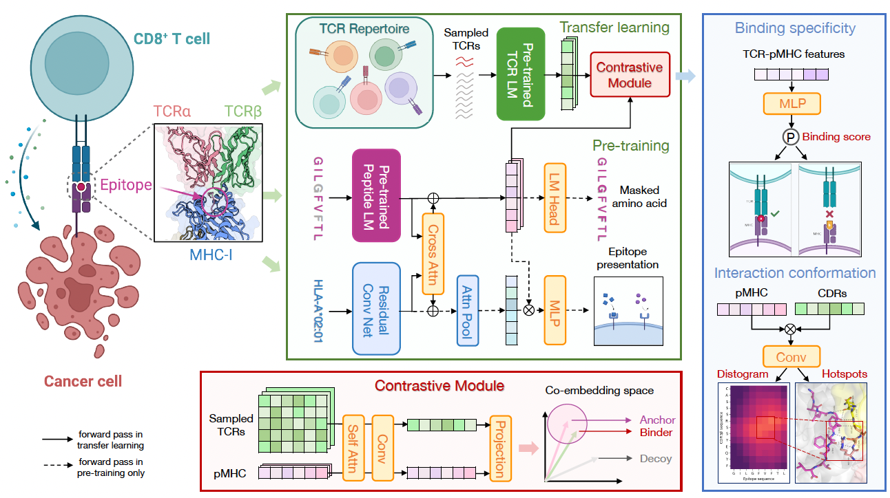

## EPACT

This repository contains the source code for the paper [**Epitope-anchored contrastive transfer learning for paired CD8^+^ T cell receptor-antigen recognition**](https://www.biorxiv.org/content/10.1101/2024.04.05.588255v1).



EPACT is developed by a divide-and-conquer paradigm that combines **pre-training** on TCR or pMHC data and **transfer learning** to predict TCR$\alpha\beta$-pMHC binding specificity and interaction conformation via **epitope-anchored** **contrastive** **learning**.

### Installation

1. Clone the repository.

   ```python
   git clone https://github.com/zhangyumeng1sjtu/EPACT.git
   ```
2. Create a virtual environment by conda.

   ```python
   conda create -n EPACT_env python=3.10.12
   conda activate EPACT_env
   ```
3. Download PyTorch>=2.0.1, which is compatible with your CUDA version and other Python packages.

   ```python
   conda install pytorch==2.0.1 pytorch-cuda=11.7 -c pytorch -c nvidia # for CUDA 11.7
   pip install -r requirements.txt
   ```

### Data and model checkpoints

The following [data](https://drive.google.com/file/d/1NC0m7KJVFIERvtpWdWzEvYQk9QWBdkBO/view?usp=sharing) and [model checkpoints](https://drive.google.com/file/d/1ol1-vKKQqXSg9KP8sIlcApGuAanajNgo/view?usp=sharing) are available at Google drive after request.

- `data/binding`: binding data between paired TCR$\alpha\beta$ and pMHC derived from IEDB, VDJdb, McPAS, TBAdb, 10X, and Francis et al.
- `data/pretrained`: human peptides from IEDB, human CD8+ TCRs from 10X Genomics Datasets and STAPLER, peptide-MHC-I binding affinity data from NetMHCpan4.1, and peptide-MHC-I eluted ligand data from BigMHC.
- `data/structure`: Crystal structures of TCR-pMHC protein complexes in STCRDab. Distance matrices were calculated according to the closest distance between heavy atoms from two amino acid residues.
- `checkpoints/paired-cdr3-pmhc-binding`: model checkpoints for predicting TCR$\alpha\beta$-pMHC binding specificity from CDR3 sequences.
- `checkpoints/paired-cdr123-pmhc-binding`: model checkpoints for predicting TCR$\alpha\beta$-pMHC binding specificity from CDR1, CDR2, and CDR3 sequences.
- `checkpoints/paired-cdr123-pmhc-interaction`: model checkpoints for predicting CDR-epitope residue-level distance matrix and contact sites.
- `checkpoints/pretrained`: model checkpoints for pre-trained language model of TCRs and peptides, and peptide-MHC models (binding affinity & eluted ligand).

### Usage

#### 1. Pre-training

- Pre-train peptide and TCR$\alpha\beta$ language models.

  ```bash
  # pretrain epitope masked language model.
  python pretrain_plm.py --config configs/config-pretrain-epitope-lm.yml

  # pretrain paired cdr3 masked language model.
  python pretrain_plm.py --config configs/config-pretrain-cdr3-lm.yml

  # pretrain paired cdr123 masked language model.
  python pretrain_plm.py --config configs/config-pretrain-cdr123-lm.yml
  ```
- Train peptide-MHC binding affinity or eluted ligand models.

  ```bash
  # pretrain peptide-MHC binding affinity model.
  python pretrain_pmhc_model.py --config configs/config-pmhc-binding.yml

  # pretrain peptide-MHC eluted ligand model.
  python pretrain_pmhc_model.py --config configs/config-pmhc-elution.yml
  ```

#### 2. Predict binding specificity

- Train TCR$\alpha\beta$-pMHC binding models.

  ```bash
  # finetune Paired TCR-pMHC binding model (CDR3).
  python train_tcr_pmhc_binding.py --config configs/config-paired-cdr3-pmhc-binding.yml 

  # finetune Paired TCR-pMHC binding model (CDR123).
  python train_tcr_pmhc_binding.py --config configs/config-paired-cdr123-pmhc-binding.yml
  ```
- Predict TCR$\alpha\beta$-pMHC binding specificity.

  ```bash
  # predict cross-validation results
  for i in {1..5}
  do
      python predict_tcr_pmhc_binding.py \
          --config configs/config-paired-cdr123-pmhc-binding.yml \
          --input_data_path data/binding/Full-TCR/k-fold-data/val_fold_${i}.csv \
          --model_location checkpoints/paired-cdr123-pmhc-binding/paired-cdr123-pmhc-binding-model-fold-${i}.pt\
          --log_dir results/preds-cdr123-pmhc-binding/Fold_${i}/
  done
  ```
- Predict TCR$\alpha\beta$-pMHC binding ranks compared to background TCRs

  ```bash
  # predict binding ranks for SARS-CoV-2 responsive TCR clonotypes
  python predict_tcr_pmhc_binding_rank.py --config configs/config-paired-cdr123-pmhc-binding.yml \
                                          --log_dir results/ranking-covid-cdr123/ \
                                          --input_data_path data/binding/covid_clonotypes.csv \
                                          --model_location checkpoints/paired-cdr123-pmhc-binding/paired-cdr123-pmhc-binding-model-all.pt \
                                          --bg_tcr_path data/pretrained/10x-paired-healthy-human-tcr-repertoire.csv \
                                          --num_bg_tcrs 20000
  ```

#### 3. Predict interaction conformation

- Train TCR$\alpha\beta$-pMHC interaction model.

  ```bash
  # finetune Paired TCR-pMHC interaction model (CDR123).
  python train_tcr_pmhc_interact.py --config configs/config-paired-cdr123-pmhc-interact.yml
  ```
- Predict TCR$\alpha\beta$-pMHC interaction conformations.

  ```bash
  # predict distance matrices and contact sites between MEL8 TCR and HLA-A2-presented peptides.
  for i in {1..5}
  do
      python predict_tcr_pmhc_interact.py --config configs/config-paired-cdr123-pmhc-interact.yml \
          --input_data_path data/MEL8_A0201_peptides.csv \
          --model_location checkpoints/paired-cdr123-pmhc-interaction/paired-cdr123-pmhc-interaction-model-fold-${i}.pt \
          --log_dir results/interaction-MEL8-bg-cdr123-closest/Fold_${i}/
  done
  ```

### Citation

```tex
@article {Zhang2024.04.05.588255,
	author = {Yumeng Zhang and Zhikang Wang and Yunzhe Jiang and Dene R Littler and Mark Gerstein and Anthony W Purcell and Jamie Rossjohn and Hong-Yu Ou and Jiangning Song},
	title = {Epitope-anchored contrastive transfer learning for paired CD8+ T cell receptor-antigen recognition},
	elocation-id = {2024.04.05.588255},
	year = {2024},
	doi = {10.1101/2024.04.05.588255},
	publisher = {Cold Spring Harbor Laboratory},
	URL = {https://www.biorxiv.org/content/early/2024/04/07/2024.04.05.588255},
	eprint = {https://www.biorxiv.org/content/early/2024/04/07/2024.04.05.588255.full.pdf},
	journal = {bioRxiv}
}
```

### Contact

If you have any questions, please contact us at [zhangyumeng1@sjtu.edu.cn](mailto:zhangyumeng1@sjtu.edu.cn) or [jiangning.song@monash.edu](mailto:jiangning.song@monash.edu).
